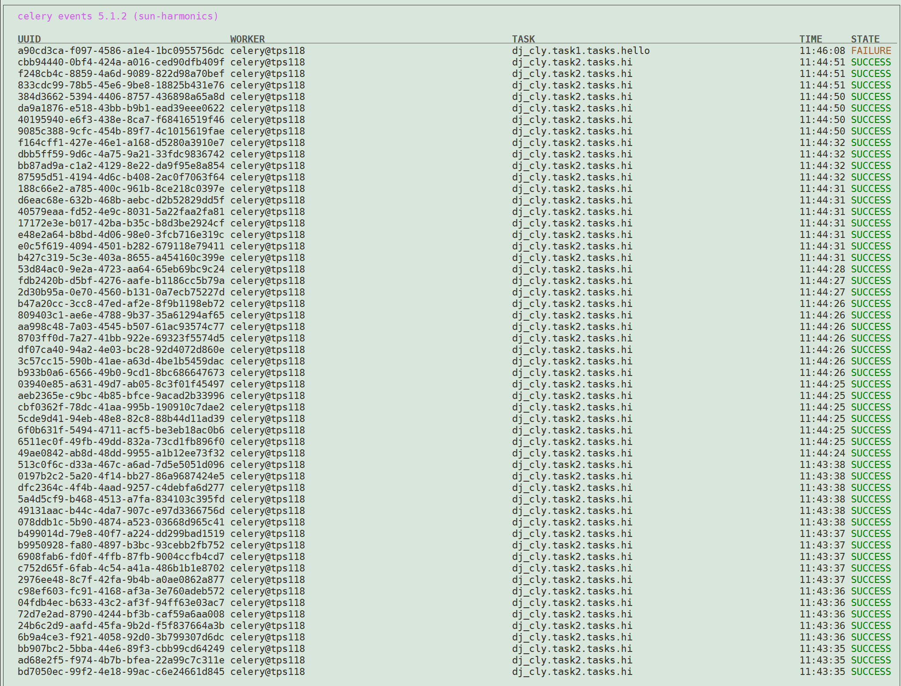
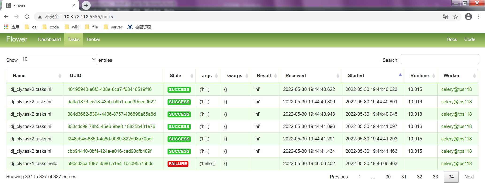
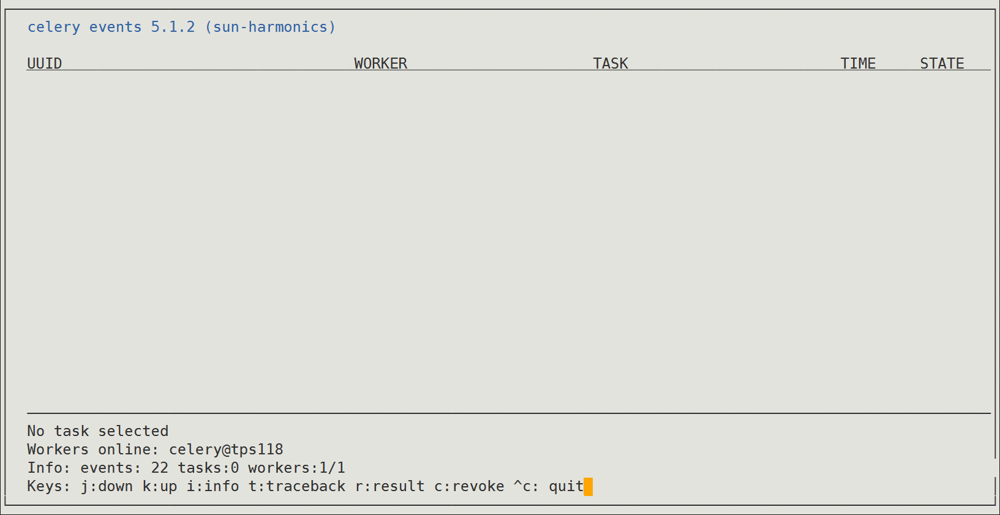

# celery 教程

## 1.环境

- redis 任务队列
- celery 异步
- django  web接口
- gunicorn 负载均衡
- flower 监控

## 2.启动


- 启动redis

  ```
  SHELL_PATH=$(cd $(dirname $0);pwd)
  cd $SHELL_PATH/..
  redis-server /etc/redis.conf > /dev/null 2>&1 &
  sleep 3
  tailf /var/log/redis/redis.log
  ```

- 启动django

  ```
  # 单进程启动
  SHELL_PATH=$(cd $(dirname $0);pwd)
  cd $SHELL_PATH/..
  python3 manage.py runserver 0.0.0.0:8005
  
  # 多进程启动
  SHELL_PATH=$(cd $(dirname $0);pwd)
  cd $SHELL_PATH/..
  echo `pwd`
  gunicorn -c bin/gunicorn.conf.py  dj.wsgi:application
  ```

- 启动celery

  ```
  # 单进程启动
  SHELL_PATH=$(cd $(dirname $0);pwd)
  cd $SHELL_PATH/..
  # dj_cly.celery_app
  celery -A dj_cly.celery_app worker -l INFO
  
  # 协程启动
  SHELL_PATH=$(cd $(dirname $0);pwd)
  cd $SHELL_PATH/..
  celery -A dj_cly.celery_app worker -P eventlet -c 1000 -l INFO
  ```

- 监控

  ```
  # 启动监控
  SHELL_PATH=$(cd $(dirname $0);pwd)
  cd $SHELL_PATH/..
  # linux界面监控
  celery -A dj_cly.celery_app events
  
  # 启动web
  SHELL_PATH=$(cd $(dirname $0);pwd)
  cd $SHELL_PATH/..
  # web端口监控
  celery -A dj_cly.celery_app flower --port=5555
  ```

## 3.实战

- 生产者：函数+celery注解 自定义任务

```text
生产者代码
import time

import celery

backend = 'redis://127.0.0.1:6379/1'
broker = 'redis://127.0.0.1:6379/2'

app = celery.Celery('hello', backend=backend, broker=broker)


@app.task
def hello(s):
    print("start")
    time.sleep(60)
    print(s)
    print("end")
    return 'hello'


@app.task
def hi(s):
    print("start")
    time.sleep(60)
    print(s)
    print("end")
    return 'hi'

生产者启动 注意启动时启动模块还是启动包里面app, 需要和导入的包进行适配
单任务需要从包内部启动 celery -A celery_task worker -l INFO
多任务需要从包外部启动 celery -A celery_multitask worker -l INFO -P eventlet

[root@tps209 test]# celery -A test worker -l INFO
/usr/local/lib/python3.6/site-packages/celery/platforms.py:798: RuntimeWarning: You're running the worker with superuser privileges: this is
absolutely not recommended!

Please specify a different user using the --uid option.

User information: uid=0 euid=0 gid=0 egid=0

  uid=uid, euid=euid, gid=gid, egid=egid,
 
 -------------- celery@tps209 v5.0.0 (singularity)
--- ***** ----- 
-- ******* ---- Linux-3.10.0-1062.18.1.el7.x86_64-x86_64-with-centos-7.7.1908-Core 2022-05-26 16:26:47
- *** --- * --- 
- ** ---------- [config]
- ** ---------- .> app:         hello:0x7f4f87ddada0
- ** ---------- .> transport:   redis://127.0.0.1:6379/2
- ** ---------- .> results:     redis://127.0.0.1:6379/1
- *** --- * --- .> concurrency: 64 (prefork)
-- ******* ---- .> task events: OFF (enable -E to monitor tasks in this worker)
--- ***** ----- 
 -------------- [queues]
                .> celery           exchange=celery(direct) key=celery
                

[tasks]
  . test.hello
  . test.hi

[2022-05-26 16:26:49,983: INFO/MainProcess] Connected to redis://127.0.0.1:6379/2
[2022-05-26 16:26:49,994: INFO/MainProcess] mingle: searching for neighbors
[2022-05-26 16:26:51,015: INFO/MainProcess] mingle: all alone
[2022-05-26 16:26:51,027: INFO/MainProcess] celery@tps209 ready.

生产者Redis注册ID
[root@tps209 ~]# redis-cli -h localhost -p 6379 -n 1 keys \*
 1) "celery-task-meta-c8e333d2-b144-4a45-acd6-2ccf9cfa52c3"
 2) "celery-task-meta-60f188df-4ee8-41a2-92ee-67c109c22be1"
 3) "celery-task-meta-73335402-590a-445d-99b7-f045a47a5330"
 4) "celery-task-meta-587db990-8649-437e-b868-7b0648335e37"
 5) "celery-task-meta-2b938bae-0bd5-4ff1-84ff-347e77e446a8"
 6) "celery-task-meta-c2dde9f6-22ad-4470-8d83-78eea2676629"
 7) "celery-task-meta-7c8db12b-efd9-4d9c-8c2c-a0b6bf7d90de"
 8) "celery-task-meta-965e2ba7-391e-4495-b2df-22c5b6fab9fa"
 9) "celery-task-meta-286d13e2-5b69-4734-84f0-66913d51f308"
10) "celery-task-meta-4996ddcd-e814-4664-8616-9ad29a86016e"
11) "celery-task-meta-19b0a8c7-155c-4758-a8ab-a056e86e4c01"
12) "celery-task-meta-c5791baa-e960-4cb0-8636-91b2dad9da12"
13) "celery-task-meta-86341b46-8c8f-47d9-b01a-678b722882d0"
14) "celery-task-meta-ac3bffab-27fe-4b76-97ec-a8e5db414bc7"
15) "celery-task-meta-c8365524-bf63-46c2-b59a-21ba9c7958f8"
16) "celery-task-meta-72cada77-b432-46e2-b0dc-db8eb217df15"
17) "celery-task-meta-14c8c571-84a8-4f99-876f-9b646651cbca"
```

- 消费者: 调用函数+delay+获取结果

```text
消费者消费代码
import time

from celery_task import hi, hello
from celery.result import AsyncResult
from celery_task import app

hi_res = hi.delay('hi')
print(hi_res.id)

hello_res = hello.delay('hello')
print(hello_res.id)

async_result = AsyncResult(id=hi_res.id, app=app)
while async_result.state != 'SUCCESS':
    print('任务处理中...')
    time.sleep(10)
if async_result.successful():
    result = async_result.get()
    print(result)

消费者消费结果
[root@tps209 ~]# redis-cli -h localhost -p 6379 -n 1 
localhost:6379[1]> get 'celery-task-meta-c8e333d2-b144-4a45-acd6-2ccf9cfa52c3'
"{\"status\": \"SUCCESS\", \"result\": \"hello\", \"traceback\": null, \"children\": [], \"date_done\": \"2022-05-26T08:45:38.207691\", \"task_id\": \"c8e333d2-b144-4a45-acd6-2ccf9cfa52c3\"}"
```


# 附件

## 1.redis操作

```text
pip install celery
pip install redis

启动redis
[root@tps209 celery_multitask]# redis-server
85034:C 26 May 18:49:23.522 # Warning: no config file specified, using the default config. In order to specify a config file use redis-server /path/to/redis.conf
                _._                                                  
           _.-``__ ''-._                                             
      _.-``    `.  `_.  ''-._           Redis 3.2.12 (00000000/0) 64 bit
  .-`` .-```.  ```\/    _.,_ ''-._                                   
 (    '      ,       .-`  | `,    )     Running in standalone mode
 |`-._`-...-` __...-.``-._|'` _.-'|     Port: 6379
 |    `-._   `._    /     _.-'    |     PID: 85034
  `-._    `-._  `-./  _.-'    _.-'                                   
 |`-._`-._    `-.__.-'    _.-'_.-'|                                  
 |    `-._`-._        _.-'_.-'    |           http://redis.io        
  `-._    `-._`-.__.-'_.-'    _.-'                                   
 |`-._`-._    `-.__.-'    _.-'_.-'|                                  
 |    `-._`-._        _.-'_.-'    |                                  
  `-._    `-._`-.__.-'_.-'    _.-'                                   
      `-._    `-.__.-'    _.-'                                       
          `-._        _.-'                                           
              `-.__.-'                                               

85034:M 26 May 18:49:23.525 # WARNING: The TCP backlog setting of 511 cannot be enforced because /proc/sys/net/core/somaxconn is set to the lower value of 128.
85034:M 26 May 18:49:23.525 # Server started, Redis version 3.2.12
85034:M 26 May 18:49:23.525 # WARNING overcommit_memory is set to 0! Background save may fail under low memory condition. To fix this issue add 'vm.overcommit_memory = 1' to /etc/sysctl.conf and then reboot or run the command 'sysctl vm.overcommit_memory=1' for this to take effect.
85034:M 26 May 18:49:23.525 # WARNING you have Transparent Huge Pages (THP) support enabled in your kernel. This will create latency and memory usage issues with Redis. To fix this issue run the command 'echo never > /sys/kernel/mm/transparent_hugepage/enabled' as root, and add it to your /etc/rc.local in order to retain the setting after a reboot. Redis must be restarted after THP is disabled.
85034:M 26 May 18:49:23.525 * The server is now ready to accept connections on port 6379

redis 查看所有的数据库
config get *

redis 删除所有数据库
flushall

redis 选择数据库
select 1

redis 进入指定的数据库
redis-cli -h localhost -p 6379 -n 1
redis-cli -h localhost -p 6379 -n 1 keys \*

redis查看所有的key
scan 1
keys *

配置不自动持久化到数据文件(报错临时解决)
[root@tps209 ~]# redis-cli -h localhost -p 6379 
localhost:6379> config set stop-writes-on-bgsave-error no
配置不自动持久化到数据文件(报错永久解决)
vim /etc/redis.conf
stop-writes-on-bgsave-error no
带配置文件启动redis
redis-server /etc/redis.conf
查看日志
[root@tps209 src]# find / -name redis.log
/var/log/redis/redis.log
查看redis数据
localhost:6379[2]> get celery-task-meta-46ddbb65-1ac5-43e5-9c4a-d530aedc481a
"{\"status\": \"SUCCESS\", \"result\": \"hello\", \"traceback\": null, \"children\": [], \"date_done\": \"2022-05-27T02:28:57.249306\", \"task_id\": \"46ddbb65-1ac5-43e5-9c4a-d530aedc481a\"}"
```

## 2.截图





